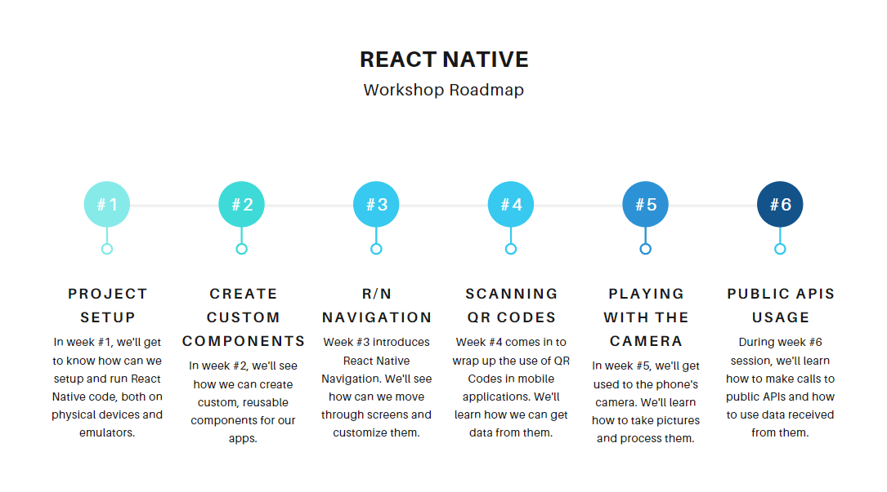
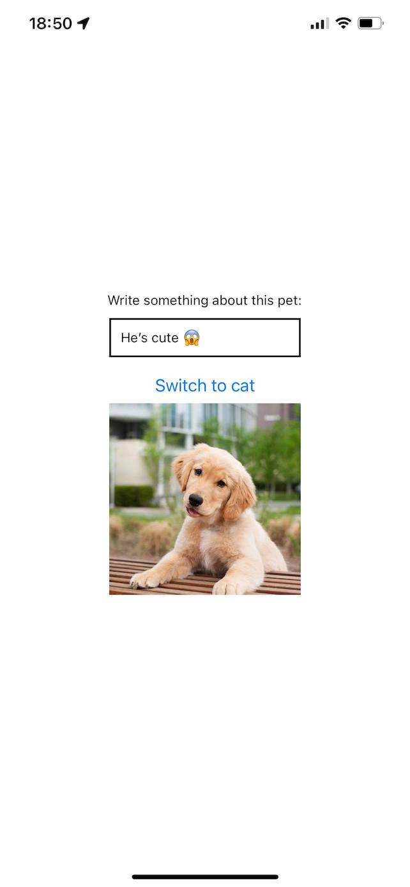
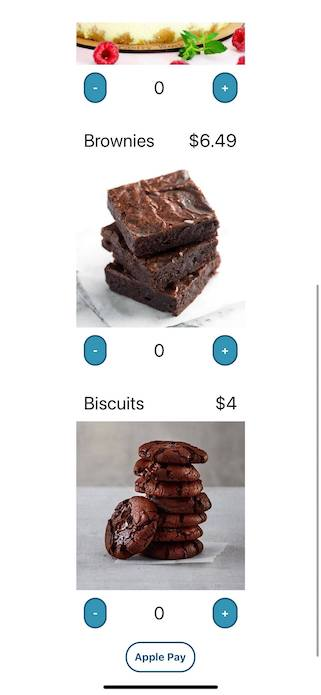
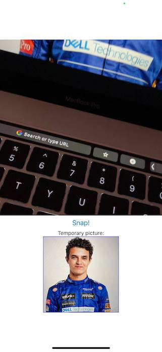

# UVT GDSC React Native Workshop
___
## What is this about?
Material taught at the React Native Workshop of Google Developer Students Club from West University of Timisoara.

Workshop Sessions Calendar: from November 7th to December 12th, once a week.
___
## Workshop Roadmap

___
## Session 1 - Project Setup
During this session, information such as how one initializes an application with Expo was taught.

Steps for project setup:
1. Download an IDE (Visual Studio Code, WebStorm ...)
2. Download Xcode / Android Studio for simulators / emulators
3. Download Node.js LTS.
4. Install expo-cli globally: `npm i -g expo-cli`
5. Initialize an application in the current directory: `expo init . --npm`
6. Run the application: `npm start`
7. Scan the QR code / run the app in a simulator / emulator

Basic React Native components such as `View`, `Text`, `Button`, `Image` were introduced.

___
## Session 2 - Create Custom Components
During the second session of the workshop, custom components were created. We saw in the first session that buttons on iOS are different from those on Android. If we want to have the same style for our app on both platforms, we should consider using custom components.

Custom components created in this session:
- `CustomButton` - for displaying a button, which can be filled or unfilled
- `Product` - for displaying a product, which has `title`, `price`, `imgUrl` and `amount`
- `PaymentModal` - for displaying a modal in which a summary of the order is displayed

___
## Session 3 - React Native Navigation
During the third session of the workshop, React Native navigation was presented, namely Stack Navigation, Tab Navigation and Drawer Navigation.

[React Navigation library](https://reactnavigation.org/) was used in this workshop, so make sure you go & check their documentation for more useful info.

### Screens setup
Firstly, check the screen under the `/screens` directory. There you'll see `F1VideosScreen`. In order for this one to display properly, you should run:
`expo install react-native-webview` & `npm install react-native-youtube-iframe`. The library used is [React Native Youtube-iframe](https://lonelycpp.github.io/react-native-youtube-iframe/) so make sure you check their documentation for more info.

### Navigation setup
In `App.js`, under the `App` component, you should see three different navigations: Stack, Tab & Drawer. When you run the app, make sure to let just one uncommented.

#### General setup
1. `npm install @react-navigation/native`
2. `expo install react-native-screens react-native-safe-area-context`

#### Stack Navigation setup steps
1. `npm install @react-navigation/native-stack`

#### Tab Navigation setup steps
1. `npm install @react-navigation/bottom-tabs`
2. `@expo/vector-icons/Ionicons` // note that this is optional, and it is only necessary if you would like those icons for the bottom tabs

#### Drawer Navigation setup steps
1. `npm install @react-navigation/drawer`
2. `expo install react-native-gesture-handler react-native-reanimated`

| Stack Navigation | Tab Navigation | Drawer Navigation |
|:---:|:---:|:---:|
|  |  |  |
___
## Session 4 - Scanning QR Codes
During the fourth session of the workshop, QR code scanning was introduced together with how we can use data inside them.

To scan QR codes, the library used is [Expo's BarCodeScanner](https://docs.expo.dev/versions/latest/sdk/bar-code-scanner/), so make sure you read the documentation found on their website.

To run this app, you need to set up the stack navigation introduced in a previous session and run `expo install expo-barcode-scanner`.

___
## Session 5 - Playing with the camera
During the fifth session of the workshop, we saw how we can take pictures / videos with the camera and went through the library's documentation to see how we can further develop our code in order to save that media since it's stored only as a temp file.

[Camera](https://docs.expo.dev/versions/latest/sdk/camera/) library from Expo was used, so make sure you go through their documentation to learn more. To use it, just run `expo install expo-camera`.

___
## Session 6 - Public APIs usage
During the sixth and final session of the workshop, the usage of `fetch` was introduced.

Looking into [Public APIs](https://github.com/public-apis/public-apis) repository, we discovered a public API that, on each fetch, gives us a different cat photo. After we finished with that, we went through more public APIs and identified real life use cases for some of them. There are lots of awesome APIs, so if you want to find something suitable for you, make sure to check that repo.

